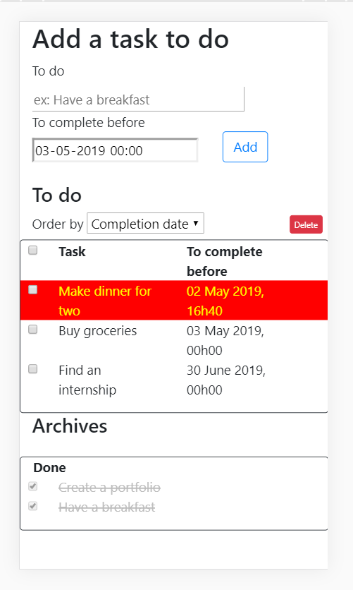

My first Todo List
=================================

Project of [Ismail Joseph](https://github.com/Fesouille)
----------------------------------

* Project:
I have to create a basic but reliable todo list. The list has to be managed via a database.

* Content:
	* PHP file: handles the access to the database and displays the required data.

	* MySQL database: to store the tasks and access them.

	* Javascript file: this file manages functionalities for the user experience:
		* Modyfying the database via AJAX: the user can add, remove and archive the tasks to do. This is all managed thanks to AJAX.
		* Checking if a task has expired. If yes, the task is highlighted in red and yellow and shakes every 2.5 seconds.
			* [GSAP](https://greensock.com/) is used here to manage the shaking animation.
		* Button to organize the tasks based on given criteria (e.g. alphabetical, creation date, expiring date).
		* You can drag and drop the tasks to reorganiz them.
			* JQUERY functions are used here.
			
	* CSS file: handles the style of the HTML elements.
	
	* CDN: to access bootstrap library and better manage the layout of the website.

* Progress Opportunities:
  * Managing the expiring state directly in the database (it is currently done only via javascript).
  * The general style (layout, colors, ...).

* Try it out ! :
	* [Todo List](https://joseph.webtech.one/todo-list/)

* A few illustrating pictures:

